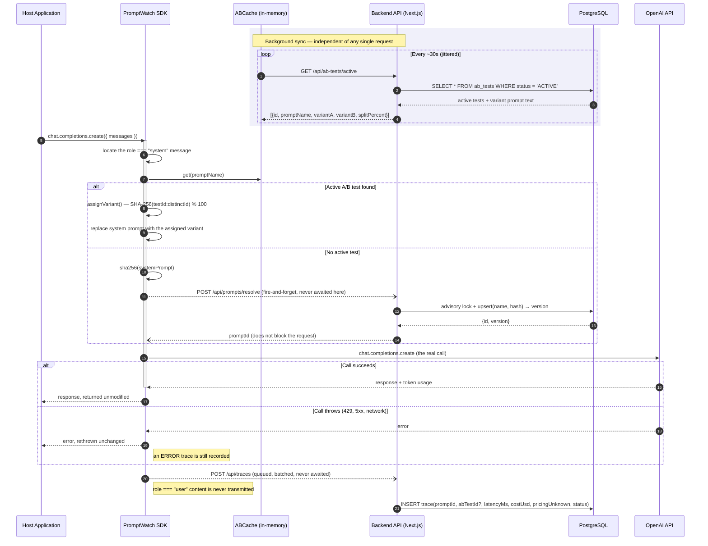
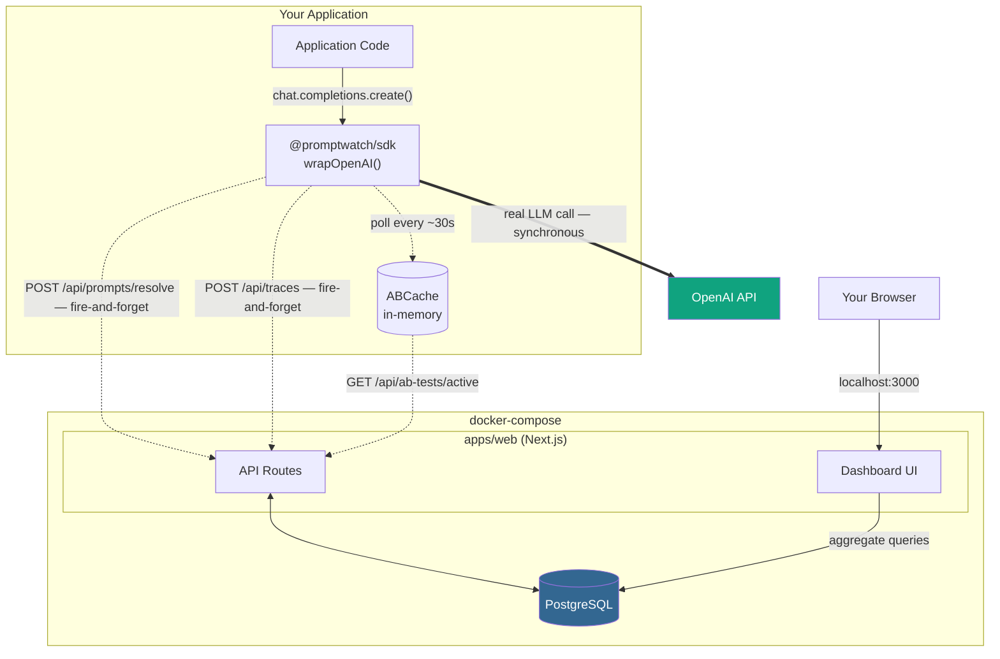

# PromptWatch

[](LICENSE)
[](https://github.com/sekerderya/prompt-watch/actions/workflows/ci.yml)
[](https://www.typescriptlang.org/)
[](https://nextjs.org/)
[](https://www.postgresql.org/)
[](https://www.docker.com/)

> Drop-in, privacy-first observability for LLM system prompts — automatic versioning, statistically-gated A/B testing, and real-time cost/latency telemetry that never blocks your model calls.

PromptWatch wraps your existing OpenAI client with a single function call. From that point on, every system prompt is automatically hashed and versioned, requests can be routed through a live A/B test with sticky per-user bucketing, and every call's cost, latency, and outcome streams to a self-hosted dashboard — without ever touching your users' data, and without PromptWatch's own backend ever sitting on the path of your model call.

`wrapOpenAI` returns a proxy; the client you pass in is left untouched, and wrapping the same client twice is a no-op rather than a source of duplicate traces.

## Quickstart

```bash
git clone https://github.com/sekerderya/prompt-watch.git
cd prompt-watch
npm install
npm run build --workspace=packages/sdk   # compile the SDK (creates packages/sdk/dist)
npx prisma generate --schema=apps/web/prisma/schema.prisma   # generate typed Prisma client for host builds
cp .env.example .env   # optional: set OPENAI_API_KEY to use real OpenAI calls
docker compose up -d   # starts PostgreSQL and the Next.js backend
npm run demo
```

Then open **http://localhost:3000** — the dashboard updates in real time as the demo runs.

### Step-by-step

1. **Install dependencies** — `npm install` resolves the monorepo workspaces (`apps/*`, `packages/*`, `examples/*`).
2. **Build the SDK** — `npm run build --workspace=packages/sdk` compiles `@promptwatch/sdk` and produces `packages/sdk/dist/`. Without it, `npm run demo` and `examples/basic-node-app` crash with `Cannot find module '@promptwatch/sdk'`.
3. **Generate the Prisma client** — `npx prisma generate --schema=apps/web/prisma/schema.prisma` produces the type-safe client from `apps/web/prisma/schema.prisma`. Run this before any host-side `npm run build`; without it, Prisma model types are unresolved and route callbacks can fail with "implicitly has an 'any' type" TypeScript errors.
4. **Copy the environment template** — `cp .env.example .env` creates the local env file at the repo root. Leave `OPENAI_API_KEY` empty to run the demo in mock mode, or fill it in to use real OpenAI calls.
5. **Start the stack** — `docker compose up -d` launches PostgreSQL and the backend (`apps/web`). The container automatically applies any pending prisma migrations on startup before starting the dev server, which fully handles schema setup.
6. **Run the demo** — `npm run demo` drives the full flow end-to-end: automatic prompt versioning, A/B test creation, sticky per-user bucketing, streaming, then stops the test it created so the script is safe to run repeatedly.

By default the demo runs against a deterministic mock client, so no API key is required. To see it run against real OpenAI calls, set `OPENAI_API_KEY` in `.env` before running `npm run demo`.

### Development

| Command | What it does |
| --- | --- |
| `npm test` | SDK and backend test suites |
| `npm run lint` | ESLint across every workspace |
| `npm run typecheck` | `tsc --noEmit` for the SDK and the web app |
| `npm run build` | Builds the SDK, then the Next.js app |

CI runs all four plus a production image build, and every one of them can fail the build.

**Authentication (optional):** By default the backend runs with auth DISABLED (no `PROMPTWATCH_API_KEY` set), so the Quickstart and demo work out of the box. For any shared or internet-facing deployment, set `PROMPTWATCH_API_KEY` in `.env` — `docker-compose.yml` passes it into the backend container, which then requires `Authorization: Bearer <key>` on all API routes. The SDK attaches the key automatically when you pass `apiKey` to `wrapOpenAI()`.

## Deploying

The Quickstart stack runs `next dev` behind a bind mount, which is right for local work and wrong for anything else. For a real deployment there is a separate multi-stage image that builds a production bundle and runs it as a non-root user:

```bash
PROMPTWATCH_API_KEY=$(openssl rand -hex 32) POSTGRES_PASSWORD=$(openssl rand -hex 16) docker compose -f docker-compose.prod.yml up -d --build
```

Both variables are required — compose refuses to start without them, so a deployment cannot inherit the demo's open-access default. Postgres publishes no host port, and the web service binds to `127.0.0.1` unless `PROMPTWATCH_BIND` says otherwise (put a TLS-terminating reverse proxy in front of it). Pending migrations are applied before the server accepts traffic.

## Architecture

### Request Flow (Sequence Diagram)



### System Components



## Architectural Decision Records

### ADR-1 — In-Memory `ABCache` over a Centralized Redis

**Decision:** Each SDK instance holds its own in-memory `Map` of active A/B tests, refreshed on a periodic poll (default: every 30 seconds, jittered to avoid a synchronized thundering-herd across replicas).

**Why:** The variant-assignment decision sits directly on the hot path of every single LLM call. A `Map.get()` costs nothing; a network round trip to Redis would add real, avoidable latency to every request, for a decision that tolerates eventual consistency far better than it tolerates added latency. Requiring Redis as a hard dependency also raises the adoption bar for what is meant to be an `npm install`-and-go SDK.

**Trade-off, stated plainly:** instances can disagree for up to one polling interval. If a test is created or ended, already-running instances keep serving the previous state until their next poll. For A/B testing, where a few seconds of staleness costs nothing, this is a deliberate trade-off, not an oversight.

**One active test per prompt:** the cache is keyed by prompt name, so two active tests for the same prompt would make the served variant depend on response ordering. The backend rejects a second active test for a prompt (409) under the same advisory lock the resolve path uses, and the cache resolves any leftover duplicate deterministically (newest wins) while logging a warning.

**When to revisit:** if PromptWatch ever expands from A/B testing into safety-critical feature-flagging (instant kill-switch semantics), in-memory polling stops being sufficient and a push-based invalidation layer (Redis pub/sub or a webhook) becomes necessary. That is explicitly out of scope today.

### ADR-2 — Privacy-First Data Dropping

**Decision:** The SDK inspects the outgoing message array for exactly one thing: the `role: "system"` entry. Everything else — `role: "user"` content and the model's own `role: "assistant"` output — is read only to compute token counts and is never transmitted to the backend or persisted, under any configuration.

**Why:** A system prompt is developer-authored configuration; versioning it is no different, privacy-wise, from versioning a feature flag. A user's message is exactly the class of data that KVKK (Türkiye) and GDPR (EU) exist to protect. By architecturally never transmitting it, PromptWatch removes an entire category of data-protection obligation from its own operation — there is no personal data flowing through the pipeline to be breached or governed by a DPA. This is data minimization (GDPR Art. 5(1)(c); KVKK md. 4) enforced at the architecture layer, not left as an opt-in setting that can be misconfigured.

**Trade-off, stated plainly:** this makes PromptWatch a metrics tool, not a conversation-replay tool. "Why did the model answer this specific user this way" is a question it is deliberately unable to answer. Teams that need content-level debugging need a separate, consent-aware logging layer.

### ADR-3 — Non-Blocking, Fire-and-Forget Telemetry

**Decision:** Neither the prompt-resolve call nor the trace-logging call is ever awaited before the real OpenAI request is dispatched. PromptWatch's own backend health has zero effect on the latency or success of the LLM call it observes.

**Why:** An observability tool that can slow down or break the thing it observes will not survive a single production incident review. If the backend is degraded or fully down, the host application behaves exactly as if PromptWatch were never installed — the only casualty is the observability data for that window.

**How this is actually enforced:** the resolve request is dispatched in parallel with the OpenAI call and is never awaited on the path back to the caller. Because the prompt id is only known once `/resolve` answers, the trace is emitted from that promise's continuation (`resolvePromise.then(...)`) rather than from the request path. A slow backend therefore delays the *trace*, never the response the host application is waiting on. Every backend call additionally carries an `AbortSignal` timeout, so a server that accepts a connection and then hangs cannot leak a pending request.

**An earlier version of this document overstated the guarantee.** It claimed the ordering meant the await "can never add latency to the call the host application is waiting on." That was wrong: the non-streaming path did `await resolvePromise` after the OpenAI response but *before* returning, so the caller's `create()` blocked on PromptWatch's backend — and with no timeout, a hanging backend blocked it indefinitely. The streaming path was already correct. Both paths now share the same non-blocking emit, and a regression test asserts that `create()` returns in under a second while `/resolve` stalls for three.

**Backpressure:** traces are buffered in a bounded queue (default 1000) with a single request in flight at a time. Under low load a trace ships immediately; under burst load, traces that arrive during a request coalesce into the next batch, so backend round trips scale with latency rather than with call volume. Retryable failures (429, 5xx, network) are retried with backoff; a full queue drops the oldest traces and counts them, which is visible through `TelemetryClient.stats()`.

**Trade-off, stated plainly:** if the backend is down for an hour, an hour of telemetry is gone, permanently. That failure is now surfaced through an optional `onError` hook on `wrapOpenAI` instead of only reaching `console.error`.


### ADR-4 — Opt-In Shared-Secret Auth, Not Multi-User Accounts

**Decision:** PromptWatch uses a single shared secret (`PROMPTWATCH_API_KEY`) that gates all backend API access. When the env var is unset or empty, auth is completely disabled — the Quickstart, demo, and local development experience remains identical to the pre-auth version. When set, all API routes (except `/login` and static assets) require `Authorization: Bearer <key>` or a valid `pw_session` cookie; the SDK attaches the key via an `apiKey` option.

**Why not a full user/session system:** PromptWatch is a self-hosted, single-operator observability tool for LLM system prompts. The threat model is "protect the dashboard and API from casual access on a shared network," not "isolate multiple tenants with per-user RBAC." A full auth system (passwords, email verification, password reset, sessions with CSRF, user management UI) adds enormous surface area and operational burden for a use case that doesn't need it. A single shared secret is the simplest thing that provides meaningful gatekeeping.

**Why default OFF:** Local development and the 60-second demo must work with `docker compose up -d` and `npm run demo` — zero configuration. Requiring a generated key before the first `npm run demo` adds friction that defeats the "drop-in" promise. The trade-off is explicit: anyone who deploys PromptWatch to a shared network without setting `PROMPTWATCH_API_KEY` is consciously choosing open access. The docs state this clearly.

**Why hash + constant-time comparison:** The secret is never stored in plaintext in the database or logs. The middleware hashes the incoming candidate with SHA-256 (via Web Crypto API, available in both Node and Edge runtimes) and compares it to the hash of the configured key using a byte-by-byte XOR accumulation loop that never early-exits. This defeats timing attacks even if the attacker can measure nanosecond-scale differences, and because both sides are pre-hashed to fixed-length hex strings, no length-based exception can occur (unlike `node:crypto.timingSafeEqual` which throws on length mismatch).

**Rate limiting:** hashing plus constant-time comparison defends the secret against a timing side-channel, but for a long time left the far cheaper attack — guessing it — completely unbounded. `/api/auth/login` is now limited to 10 attempts per five minutes per client, keyed on the forwarded client address, answering 429 with `Retry-After` beyond that. The counter is in process memory, which matches the single-instance deployment model; a replicated deployment would need a shared store.

**Why Web Crypto API, not `node:crypto`:** Next.js Middleware runs on the Edge runtime where `node:crypto` is unavailable. `crypto.subtle.digest("SHA-256", ...)` works identically in Node, Edge, and browser contexts, keeping the auth logic portable and runtime-agnostic.

**When to revisit:** If PromptWatch ever needs multi-tenant deployments (separate teams on the same backend, per-user audit logs, SSO/SAML/OIDC integration), the shared-secret model will need to be replaced with a proper identity provider. That is explicitly out of scope today — the architecture document marks this as a future decision point.

**Note on session cookie:** The `pw_session` cookie carries the raw shared secret (`PROMPTWATCH_API_KEY`) directly — not a hashed value, not a separate session token. This is an explicit design choice for a single-operator, self-hosted tool: the credential itself IS the session value. It is protected by HttpOnly, Secure (in production), and SameSite=Lax flags. There is no additional session-layer middleware beyond the simple Bearer-cookie check in the auth middleware. For a one-person tool, this eliminates the complexity of a full session management system while still providing meaningful access control. Acceptable because the threat model is "protect from casual access on shared networks," not "isolate multi-tenant users."

### ADR-5 — Transparent Streaming Support via Stream Wrapping

**Decision:** Wrap the OpenAI `create()` response stream with `wrapStream` so that
`include_usage` can be injected silently (the synthetic usage-only chunk is never
yielded to the caller). Latency is measured as time-to-first-chunk, not total stream
duration.

**Why:** Transparent wrapping means existing non-streaming code paths are untouched; the
streaming block is inserted only when `(requestBody as any).stream === true`. This keeps
the fire-and-forget telemetry principle intact and avoids blocking the real OpenAI call.

**Termination is the subtle part.** A stream ends one of three ways, and each must produce
telemetry exactly once: it runs to completion, it throws, or the consumer stops iterating
early. The third case is the common one — a user cancels a generation — and it was
originally unhandled: `break`ing out of the loop left the generator suspended at its
`yield`, so neither the success nor the error callback ever fired. The trace was lost and
the upstream HTTP connection stayed open. Settling now happens in a `finally` block, which
records the partial call and aborts the upstream stream.

**Trade-off:** The `wrapStream` adapter only supports `for-await-of` consumption — it does
not replicate the Stream class's other methods (pipe, transform, etc.). Users needing
advanced stream transformations must handle them outside the wrapper. This is explicitly
a telemetry-only adapter, not a full stream pipeability layer.

**When-to-revisit:** If future work requires full stream pipeability or Backpressure-aware
processing, a dedicated `Stream` class with full AsyncIterable operations should be built
separately, leaving `wrapStream` as the lightweight telemetry-only adapter.

### ADR-6 — A Winner Requires Significance, Not Just a Lower Average

**Decision:** The dashboard declares a winner for a metric only when both arms have at
least 30 traces *and* the difference clears a two-sided test at α = 0.05 — Welch's t-test
for latency and cost, a two-proportion z-test for error rate. Otherwise it shows the
numbers with either "needs 30/variant — have N vs M" or "no significant difference
(p = …)".

**Why:** The earlier version picked whichever average was lower and put a "winner" badge on
it. After a demo run that meant crowning a variant on three requests per arm, which is
noise, not a result. A tool whose entire purpose is to help someone choose between two
prompts must not hand them a confident-looking answer it has no basis for. Refusing to
answer is the more useful output.

**Scope, stated plainly:** p-values use the normal approximation rather than an exact
t-distribution, which is anti-conservative for very small samples. The minimum sample gate
is what makes that acceptable; it fires before any p-value is trusted. The aggregation
query returns `STDDEV_SAMP` and per-arm counts so the decision is made from spread and
sample size, not from means alone.

**What this still cannot tell you:** every metric here is an operational one. PromptWatch
observes cost, latency and failures — never model output (ADR-2) — so it can say which
prompt is cheaper or faster, never which one answers better. Quality comparison needs an
outcome signal the host application supplies, and that does not exist yet.

### ADR-7 — A Guessed Cost Is Labelled as a Guess

**Decision:** Pricing is resolved by longest-prefix match against the request's model id.
When nothing matches, the fallback rate is still applied but the trace is flagged
`pricingUnknown`, and every aggregate that includes such a trace is rendered with a `~`
prefix and an explicit "estimated" note.

**Why:** Cost was previously derived from `response.model`, which the API returns as a
dated snapshot id (`gpt-4o-mini-2024-07-18`) rather than the alias you requested. No
pricing key matched, so every call silently fell through to the default rate — roughly 16x
the true cost for `gpt-4o-mini`. The failure was invisible: the dashboard displayed a
precise-looking dollar figure that was simply wrong, and the unit tests missed it because
the mock echoed back the alias instead of a snapshot id.

Two changes follow from that. Prices are resolved from the *requested* model, matching
dated suffixes by prefix; and an unmatched model is surfaced rather than absorbed, because
a wrong number presented confidently is worse than an acknowledged estimate. Adding a
model to `packages/sdk/src/pricing.ts` removes the flag.
