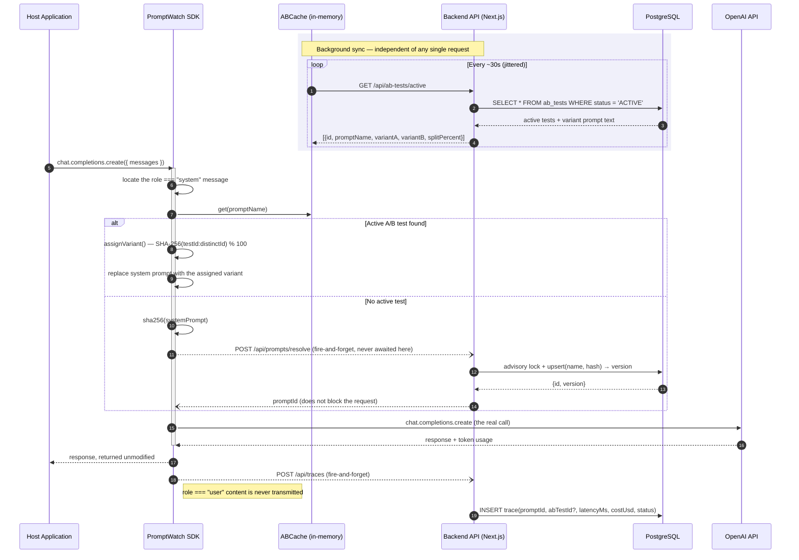
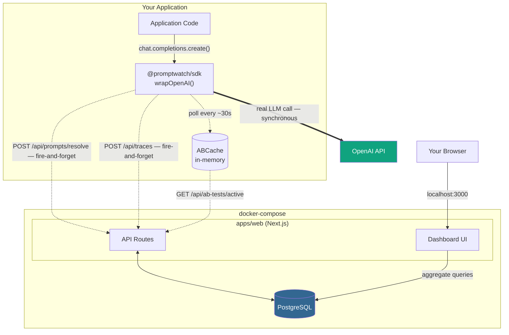

# PromptWatch

[](LICENSE)
[](https://www.typescriptlang.org/)
[](https://nextjs.org/)
[](https://www.postgresql.org/)
[](https://www.docker.com/)

> Drop-in, privacy-first observability for LLM system prompts — automatic versioning, deterministic A/B testing, and real-time cost/latency telemetry, with a zero-latency guarantee on your model calls.

PromptWatch wraps your existing OpenAI client with a single function call. From that point on, every system prompt is automatically hashed and versioned, requests can be routed through a live A/B test with sticky per-user bucketing, and every call's cost, latency, and outcome streams to a self-hosted dashboard — without ever touching your users' data, and without ever adding a millisecond to your model call.

## Architecture

### Request Flow (Sequence Diagram)



### System Components



## Architectural Decision Records

### ADR-1 — In-Memory `ABCache` over a Centralized Redis

**Decision:** Each SDK instance holds its own in-memory `Map` of active A/B tests, refreshed on a periodic poll (default: every 30 seconds, jittered to avoid a synchronized thundering-herd across replicas).

**Why:** The variant-assignment decision sits directly on the hot path of every single LLM call. A `Map.get()` costs nothing; a network round trip to Redis would add real, avoidable latency to every request, for a decision that tolerates eventual consistency far better than it tolerates added latency. Requiring Redis as a hard dependency also raises the adoption bar for what is meant to be an `npm install`-and-go SDK.

**Trade-off, stated plainly:** instances can disagree for up to one polling interval. If a test is created or ended, already-running instances keep serving the previous state until their next poll. For A/B testing, where a few seconds of staleness costs nothing, this is a deliberate trade-off, not an oversight.

**When to revisit:** if PromptWatch ever expands from A/B testing into safety-critical feature-flagging (instant kill-switch semantics), in-memory polling stops being sufficient and a push-based invalidation layer (Redis pub/sub or a webhook) becomes necessary. That is explicitly out of scope today.

### ADR-2 — Privacy-First Data Dropping

**Decision:** The SDK inspects the outgoing message array for exactly one thing: the `role: "system"` entry. Everything else — `role: "user"` content and the model's own `role: "assistant"` output — is read only to compute token counts and is never transmitted to the backend or persisted, under any configuration.

**Why:** A system prompt is developer-authored configuration; versioning it is no different, privacy-wise, from versioning a feature flag. A user's message is exactly the class of data that KVKK (Türkiye) and GDPR (EU) exist to protect. By architecturally never transmitting it, PromptWatch removes an entire category of data-protection obligation from its own operation — there is no personal data flowing through the pipeline to be breached or governed by a DPA. This is data minimization (GDPR Art. 5(1)(c); KVKK md. 4) enforced at the architecture layer, not left as an opt-in setting that can be misconfigured.

**Trade-off, stated plainly:** this makes PromptWatch a metrics tool, not a conversation-replay tool. "Why did the model answer this specific user this way" is a question it is deliberately unable to answer. Teams that need content-level debugging need a separate, consent-aware logging layer.

### ADR-3 — Non-Blocking, Fire-and-Forget Telemetry

**Decision:** Neither the prompt-resolve call nor the trace-logging call is ever awaited before the real OpenAI request is dispatched. PromptWatch's own backend health has zero effect on the latency or success of the LLM call it observes.

**Why:** An observability tool that can slow down or break the thing it observes will not survive a single production incident review. If the backend is degraded or fully down, the host application behaves exactly as if PromptWatch were never installed — the only casualty is the observability data for that window.

**How this is actually enforced:** the resolve request is dispatched in parallel with the OpenAI call, but its promise is only ever awaited after the OpenAI response has already been returned — immediately before the trace payload is built, solely to guarantee `promptId` is populated correctly. This ordering guarantees the await can never add latency to the call the host application is waiting on.

**Trade-off, stated plainly:** if the backend is down for an hour, an hour of telemetry is gone, permanently. Surfacing that failure to the host application (an `onError` hook, rather than a silent `console.error`) is a tracked follow-up, not yet implemented.

## Quickstart

```bash
git clone https://github.com/sekerderya/prompt-watch.git
cd prompt-watch
npm install
npm run build --workspace=packages/sdk
docker compose up -d
npm run demo
```

Then open **http://localhost:3000** — the dashboard updates in real time as the demo runs.

By default the demo runs against a deterministic mock client, so no API key is required. To see it run against real OpenAI calls, add `OPENAI_API_KEY` to a `.env` file at the repo root (copy `.env.example` as a starting point) before running `npm run demo`.