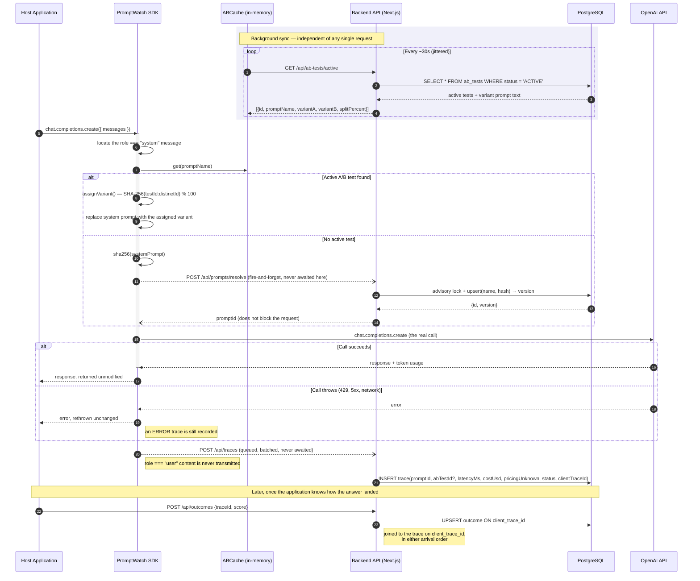
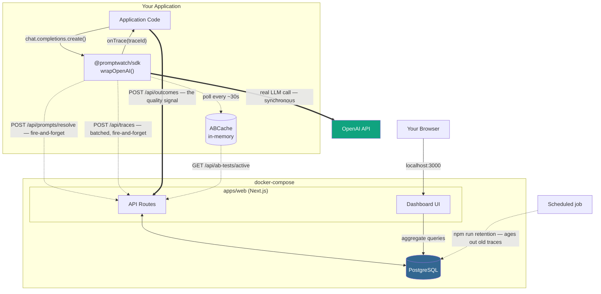

# PromptWatch

[](LICENSE)
[](https://github.com/sekerderya/prompt-watch/actions/workflows/ci.yml)
[](https://www.typescriptlang.org/)
[](https://nextjs.org/)
[](https://www.postgresql.org/)
[](https://www.docker.com/)

> Find out which of your LLM prompts is actually better, then ship it — without a deploy,
> and without ever sending your users' data anywhere.

**The problem.** Teams edit system prompts constantly and have almost no idea what the edits
did. The change lives in a git diff, the effect lives in production, and nothing connects
them. So prompts get changed on vibes, and reverted on vibes.

**What this does**, as one loop:

1. **Watches.** `wrapOpenAI(client, …)` — one call. Every system prompt is hashed and
   versioned automatically, and every request's cost, latency and failure category is
   recorded. `role: "user"` content never leaves your process.
2. **Asks.** Your application reports a score per call — a thumbs-up, a resolved ticket, a
   grader's verdict. Cost and latency are free; quality is the thing only you can know.
3. **Decides.** Two prompt versions run side by side with sticky per-user bucketing, and a
   winner is declared **only** when the difference survives a significance test.
4. **Ships.** Promoting the winner releases it to running SDK clients on their next poll.
   Rollback is one click.
5. **Watches the ship.** The live release is continuously compared against the version it
   replaced, so a bad prompt is caught rather than discovered — with unattended rollback
   available, opt-in, behind a stricter bar than the alert.

```
Quality Score   54.0% (n=87)   78.1% (n=73)  winner    p = 0.001
Avg. Latency    291 ms         280 ms                  no significant difference (p = 0.205)
Avg. Cost       $0.000035      $0.000034               no significant difference (p = 0.310)
```

That contrast is the whole point: the operational metrics say these two prompts are
indistinguishable, and only the reported outcome shows one is meaningfully better.

**If you are evaluating this repo, read two things.**
[ADR-9](docs/adr/009-corrections.md) lists every claim this project made and failed to keep,
what was actually true, and the test that now guards it — including an error rate that could
only ever read 0%, costs inflated 16x, and a CI lint step that swallowed its own failure.
[ADR-11](docs/adr/011-the-registry-serves-prompts-the-code-still-owns-them.md) covers the one
feature that threatens an earlier decision, and how it is contained.

**Try it in about a minute** — `npm run demo` walks the entire loop against a deterministic
mock, so no API key is needed:

```
4️⃣  OUTCOME-DRIVEN QUALITY COMPARISON
   160/160 calls, 160 outcomes recorded
   Variant A: quality  54.0% (87 scored) · 290ms · $0.000035/call
   Variant B: quality  78.1% (73 scored) · 280ms · $0.000034/call

6️⃣  SHIPPING THE WINNER
✅ Variant B promoted. "support-agent" now serves v2, and the test was stopped.

7️⃣  A CLIENT THAT FOLLOWS THE REGISTRY
→ Its code still says: "You are a courteous, professional customer suppo..."
✅ Prompt actually sent came from: registry (no deploy involved)

8️⃣  WHAT HAPPENS WHEN PROMPTWATCH IS DOWN
✅ Registry unreachable → prompt came from: local. The application never notices.
```

<sub>Self-hosted · TypeScript · Next.js + PostgreSQL · 270 tests, incl. route handlers
against a real Postgres in CI · no Node built-ins in the SDK, so it runs on edge runtimes
too</sub>

## Quickstart

```bash
git clone https://github.com/sekerderya/prompt-watch.git
cd prompt-watch
npm install
npm run build --workspace=packages/sdk   # compile the SDK (creates packages/sdk/dist)
npx prisma generate --schema=apps/web/prisma/schema.prisma   # generate typed Prisma client for host builds
cp .env.example .env   # optional: set OPENAI_API_KEY to use real OpenAI calls
docker compose up -d   # starts PostgreSQL and the Next.js backend
npm run demo
```

Then open **http://localhost:3000**. Three pages, updating as the demo runs:

| Page | What it shows |
| --- | --- |
| **Dashboard** | Cost, request volume, error rate and reported quality across every prompt |
| **Prompts** | Every tracked prompt, its version history, a word-level diff between any two versions, per-version metrics, a breakdown of what its failures actually were, which version is released (with one-click rollback), and a paged list of individual calls |
| **A/B Tests** | Variant comparison with a winner declared only when the difference is statistically significant — and a button to ship it |

### Step-by-step

1. **Install dependencies** — `npm install` resolves the monorepo workspaces (`apps/*`, `packages/*`, `examples/*`).
2. **Build the SDK** — `npm run build --workspace=packages/sdk` compiles `@promptwatch/sdk` and produces `packages/sdk/dist/`. Without it, `npm run demo` and `examples/basic-node-app` crash with `Cannot find module '@promptwatch/sdk'`.
3. **Generate the Prisma client** — `npx prisma generate --schema=apps/web/prisma/schema.prisma` produces the type-safe client from `apps/web/prisma/schema.prisma`. Run this before any host-side `npm run build`; without it, Prisma model types are unresolved and route callbacks can fail with "implicitly has an 'any' type" TypeScript errors.
4. **Copy the environment template** — `cp .env.example .env` creates the local env file at the repo root. Leave `OPENAI_API_KEY` empty to run the demo in mock mode, or fill it in to use real OpenAI calls.
5. **Start the stack** — `docker compose up -d` launches PostgreSQL and the backend (`apps/web`). The container automatically applies any pending prisma migrations on startup before starting the dev server, which fully handles schema setup.
6. **Run the demo** — `npm run demo` drives the full flow end-to-end: automatic prompt versioning, A/B test creation, sticky per-user bucketing, streaming, then stops the test it created so the script is safe to run repeatedly.

By default the demo runs against a deterministic mock client, so no API key is required. To see it run against real OpenAI calls, set `OPENAI_API_KEY` in `.env` before running `npm run demo`.

### Development

| Command | What it does |
| --- | --- |
| `npm test` | SDK and backend unit suites |
| `npm run test:db --workspace=apps/web` | Route handlers against a real Postgres (needs `DATABASE_URL` ending in `_test`) |
| `npm run lint` | ESLint across every workspace |
| `npm run typecheck` | `tsc --noEmit` for the SDK and the web app |
| `npm run build` | Builds the SDK, then the Next.js app |
| `npm run retention --workspace=apps/web` | Prunes telemetry past the retention window |
| `npm run watch:releases --workspace=apps/web` | Compares each live release against the version it replaced |

CI runs all of these plus a production image build against a throwaway Postgres service,
and every one of them can fail the build.

**Authentication (optional):** By default the backend runs with auth DISABLED (no `PROMPTWATCH_API_KEY` set), so the Quickstart and demo work out of the box. For any shared or internet-facing deployment, set `PROMPTWATCH_API_KEY` in `.env` — `docker-compose.yml` passes it into the backend container, which then requires `Authorization: Bearer <key>` on all API routes. The SDK attaches the key automatically when you pass `apiKey` to `wrapOpenAI()`.

## Supported APIs

Both OpenAI interfaces are instrumented, and identically — the same versioning, A/B
substitution, registry serving, error categories, cost accounting and outcome correlation
apply to each:

```ts
// Chat Completions: the prompt is the role:"system" message
await client.chat.completions.create({
  model: "gpt-4o-mini",
  messages: [{ role: "system", content: PROMPT }, { role: "user", content: question }],
});

// Responses: the prompt is `instructions`
await client.responses.create({
  model: "gpt-4o-mini",
  instructions: PROMPT,
  input: question,
});
```

The two differ in four places — where the prompt lives, what the token fields are called,
where streaming usage appears, and whether usage has to be requested. Those four sit in an
adapter table; everything else is one code path, so a fix to the error path is a fix to
both. [ADR-12](docs/adr/012-one-instrumentation-two-openai-apis.md) covers what is verified
against the SDK's own type declarations and what is not verified against the live API,
along with how the implementation degrades if a shape turns out to be wrong.

A client from an `openai` release with no `responses` property is left untouched.

## Reporting outcomes

Cost and latency are measured for you. Whether an answer was any *good* is something only
your application knows, so PromptWatch asks for it rather than guessing.

`wrapOpenAI` hands you a trace id through `onTrace`, which fires synchronously inside
`create()` — before the request reaches OpenAI, so the id is available next to the call
site even when many calls are in flight:

```ts
import { wrapOpenAI, OutcomeClient } from "@promptwatch/sdk";

const outcomes = new OutcomeClient(backendUrl, apiKey);

let pendingTraceId: string | undefined;
const client = wrapOpenAI(openai, {
  promptName: "support-agent",
  backendUrl,
  onTrace: (handle) => { pendingTraceId = handle.traceId; },
});

const answer = await client.chat.completions.create({ model, messages });
const traceId = pendingTraceId!;   // captured before the first await

// ...whenever the outcome is known: a thumbs-up, a resolved ticket, a grader's verdict.
await outcomes.record(traceId, { score: 1, label: "resolved" });
```

`score` is normalised to `0..1` so any prompt's variants stay comparable — a binary outcome
is `0` or `1`, a 1-5 star rating is `(stars - 1) / 4`. Recording is idempotent per trace id,
so a user changing their rating updates the row instead of adding a contradictory second
one, and an outcome may safely arrive before the trace it belongs to.

An application that tracks several prompts should share one poll loop and one telemetry
queue across all of them rather than wiring each separately:

```ts
import { createPromptWatch } from "@promptwatch/sdk";

const pw = createPromptWatch({ backendUrl, apiKey });
const support = pw.wrap(openai, { promptName: "support-agent" });
const summariser = pw.wrap(openai, { promptName: "summariser" });

await pw.close();   // flushes telemetry and stops polling
```

The dashboard then compares variants on quality, and only calls a winner once the gap is
statistically significant. `npm run demo` does exactly this end to end: it drives 160 calls
whose simulated satisfaction differs by variant, and the A/B page ends up reporting
something like

```
Quality Score   54.0% (n=87)      78.1% (n=73)  winner    p = 0.001
Avg. Latency    291 ms            280 ms                  no significant difference (p = 0.205)
Avg. Cost       $0.000035         $0.000034               no significant difference (p = 0.310)
```

— which is the point of the whole feature: the operational metrics say the two prompts are
indistinguishable, and only the outcome signal reveals that one is meaningfully better.

## Shipping a winner

An A/B test that ends in "variant B is better" used to leave you editing a string by hand.
Promoting the winner releases that version instead: running SDK clients pick it up on their
next poll, with no deploy.

Opt in per client, because sending text the caller did not write is an application's
decision rather than a side effect of upgrading the SDK:

```ts
const client = wrapOpenAI(openai, {
  promptName: "support-agent",
  backendUrl,
  useRegistry: true,
  // Still required, still authoritative. The registry overrides this text;
  // it never replaces it.
});

await client.chat.completions.create({
  model: "gpt-4o-mini",
  messages: [
    { role: "system", content: PROMPT_IN_YOUR_CODE },
    { role: "user", content: question },
  ],
});
```

What actually gets sent, highest precedence first:

1. **an active A/B test variant** — an experiment outranks a release, or it would be
   measuring something other than what it was set up to measure;
2. **the released version** from the registry;
3. **the prompt in your code** — including whenever the registry has nothing to say, and
   whenever PromptWatch is unreachable.

That third line is the whole reason this is safe to switch on. Serving prompts remotely
would otherwise make an observability tool a hard runtime dependency, which is precisely
what [ADR-3](docs/adr/003-non-blocking-fire-and-forget-telemetry.md) forbids. Reads come
from a polled in-memory cache, a failed poll keeps the last known-good value, and a cache
that never reached the backend holds nothing at all. `onTrace` reports which of the three
was used via `promptSource`, so this is assertable rather than assumed.

Releases are append-only: the live version is simply the newest row, so rollback is an
ordinary insert and the history can never disagree with the pointer. Promotion recomputes
the comparison server-side and stores it on the release, so the decision still explains
itself after retention has deleted the traces behind it.

`npm run demo` walks the entire loop, ending with a client whose own code contains the
losing prompt sending the promoted one — and the same client, pointed at a dead backend,
silently sending its own text again.

## Watching a release

Shipping a prompt is where this stops being an observability tool and starts changing what
production says to users. Noticing a bad change is therefore its job, not yours:

```bash
npm run watch:releases --workspace=apps/web
```

```
✗ support-agent v4 (release #12) — REGRESSION vs v3
    ! quality: 78.1% → 61.4% (p = 0.004)
      errorRate: 0.5% → 0.6% (p = 0.812)
      latency: 280ms → 291ms (p = 0.205)
    → not reverting automatically: auto-rollback is disabled
```

It exits non-zero when it finds one, so a scheduler can alert on it:

```
*/15 * * * *  docker compose exec -T web npm run watch:releases
```

The comparison reuses the A/B machinery unchanged — Welch's t-test, the two-proportion
z-test, the same 30-per-side gate. Only the axis differs: the window *before* the release
versus everything after. That "before" window is bounded on both sides, so a long-lived
prompt is compared against the hours it was actually replaced in rather than against its
own best month.

**Unattended rollback is opt-in** and deliberately harder to trigger than the alert:

```bash
PROMPTWATCH_AUTO_ROLLBACK=true
PROMPTWATCH_AUTO_ROLLBACK_MIN_SAMPLES=100   # vs 30 to merely report
```

Only quality and error-rate regressions qualify. **Latency is reported and never
auto-reverted** — a slower prompt that answers better is often the right trade, and a
machine that silently undoes that judgement is worse than one that stays quiet. When it does
act it writes an ordinary release with actor `auto-rollback` and the numbers that justified
it, so undoing *it* is the same one click as any other rollback.

[ADR-14](docs/adr/014-detecting-a-bad-release-and-when-a-machine-may-undo-it.md) covers why
detection and action are separate decisions, and states plainly what this cannot do: the
comparison is observational, so it is a regression alarm rather than proof the new prompt
caused the drop.

## Deploying

The Quickstart stack runs `next dev` behind a bind mount, which is right for local work and wrong for anything else. For a real deployment there is a separate multi-stage image that builds a production bundle and runs it as a non-root user:

```bash
PROMPTWATCH_API_KEY=$(openssl rand -hex 32) POSTGRES_PASSWORD=$(openssl rand -hex 16) docker compose -f docker-compose.prod.yml up -d --build
```

Both variables are required — compose refuses to start without them, so a deployment cannot inherit the demo's open-access default. Postgres publishes no host port, and the web service binds to `127.0.0.1` unless `PROMPTWATCH_BIND` says otherwise (put a TLS-terminating reverse proxy in front of it). Pending migrations are applied before the server accepts traffic.

## Operations

**Health.** `GET /api/health` performs a real database round trip and answers 503 when it
fails. It is deliberately unauthenticated — an orchestrator cannot present a bearer token,
and a health check that answers 401 always reads as unhealthy. Both the production image
and `docker-compose.prod.yml` wire it as their container healthcheck.

**Drilling in.** Aggregates answer "how is this prompt doing"; they cannot answer "what
happened to the request that took four seconds". The Prompts page ends with a paged list of
individual calls — timing, tokens, cost, which version ran, the failure category and the
reported score — filterable to failures only. Pagination is keyset (`before=<id>`) rather
than offset, so a page does not get slower as you go back and rows arriving mid-scroll
cannot duplicate or drop entries. There is nothing deeper to open: a trace never holds
content (ADR-2), so this is the whole of what a single call can say.

**Retention.** An observability tool writes a row per model call. At ten calls a second
that is ~860k rows a day, under a dashboard that scans the table for every rollup, so
telemetry ages out:

```bash
npm run retention --workspace=apps/web
```

It deletes traces older than `PROMPTWATCH_RETENTION_DAYS` (default 90; set `0` to keep
everything) in batches, and sweeps outcomes orphaned by the deletion — they have no foreign
key to traces, by design (ADR-8). Prompts and A/B tests are never deleted: they are
configuration, they are tiny, and a prompt version is the thing a future trace refers to.

Run it on a schedule. With the compose stack:

```
0 4 * * *  docker compose exec -T web npm run retention
```

## Architecture

### Request Flow (Sequence Diagram)



### System Components



## Architectural Decision Records

The reasoning behind the choices that shaped this project, including the ones it got
wrong. Each is a standalone document under [`docs/adr/`](docs/adr).

| # | Decision | Summary |
| --- | --- | --- |
| 1 | [In-Memory `ABCache` over a Centralized Redis](docs/adr/001-in-memory-abcache-over-a-centralized-redis.md) | Each SDK instance holds its own in-memory `Map` of active A/B tests, refreshed on a periodic poll (default: every 30 seconds, jittered to avoid a… |
| 2 | [Privacy-First Data Dropping](docs/adr/002-privacy-first-data-dropping.md) | The SDK inspects the outgoing message array for exactly one thing: the `role: "system"` entry. Everything else — `role: "user"` content and the… |
| 3 | [Non-Blocking, Fire-and-Forget Telemetry](docs/adr/003-non-blocking-fire-and-forget-telemetry.md) | Neither the prompt-resolve call nor the trace-logging call is ever awaited before the real OpenAI request is dispatched. PromptWatch's own backend… |
| 4 | [Opt-In Shared-Secret Auth, Not Multi-User Accounts](docs/adr/004-opt-in-shared-secret-auth-not-multi-user-accounts.md) | PromptWatch uses a single shared secret (`PROMPTWATCH_API_KEY`) that gates all backend API access. When the env var is unset or empty, auth is… |
| 5 | [Transparent Streaming Support via Stream Wrapping](docs/adr/005-transparent-streaming-support-via-stream-wrapping.md) | Wrap the OpenAI `create()` response stream with `wrapStream` so that `include_usage` can be injected silently (the synthetic usage-only chunk is… |
| 6 | [A Winner Requires Significance, Not Just a Lower Average](docs/adr/006-a-winner-requires-significance-not-just-a-lower-average.md) | The dashboard declares a winner for a metric only when both arms have at least 30 traces *and* the difference clears a two-sided test at α = 0.05… |
| 7 | [A Guessed Cost Is Labelled as a Guess](docs/adr/007-a-guessed-cost-is-labelled-as-a-guess.md) | Pricing is resolved by longest-prefix match against the request's model id. When nothing matches, the fallback rate is still applied but the trace… |
| 8 | [Outcomes Keyed on a Client-Generated Id, Not a Foreign Key](docs/adr/008-outcomes-keyed-on-a-client-generated-id-not-a-foreign-key.md) | The SDK generates a UUID per call, hands it to the host application through `onTrace`, and stamps it on the trace. Outcomes are stored in their… |
| 9 | [Corrections](docs/adr/009-corrections.md) | Every claim this project made and did not keep, what was actually true, and the test that now guards it. |
| 10 | [No Node Built-Ins in the SDK](docs/adr/010-no-node-built-ins-in-the-sdk.md) | The SDK imports nothing from `node:*`, so it runs on edge runtimes, Deno, Bun and the browser — the environments its own README recommended. |
| 11 | [The Registry Serves Prompts; the Code Still Owns Them](docs/adr/011-the-registry-serves-prompts-the-code-still-owns-them.md) | A released version overrides the prompt in your code, but never replaces it — the local text stays the contract and the fallback, so a backend outage cannot change application behaviour. |
| 12 | [One Instrumentation, Two OpenAI APIs](docs/adr/012-one-instrumentation-two-openai-apis.md) | Chat Completions and the Responses API share every behaviour that matters; only their four genuine differences live in an adapter, and unverified shapes degrade rather than break. |
| 13 | [Attribution Is Not Authentication](docs/adr/013-attribution-is-not-authentication.md) | Releases record a self-declared name, never a verified one — and ADR-4's threat model, written when the dashboard was read-only, is restated now that it can change production. |
| 14 | [Detecting a Bad Release, and When a Machine May Undo It](docs/adr/014-detecting-a-bad-release-and-when-a-machine-may-undo-it.md) | Every live release is compared against the version it replaced; reverting unattended is opt-in, needs more evidence than reporting does, and never happens on latency alone. |

**[ADR-9](docs/adr/009-corrections.md) is the one to read first** if you are evaluating this repo: it lists every claim the project made and did not keep, what was actually true, and the test that now guards it.
