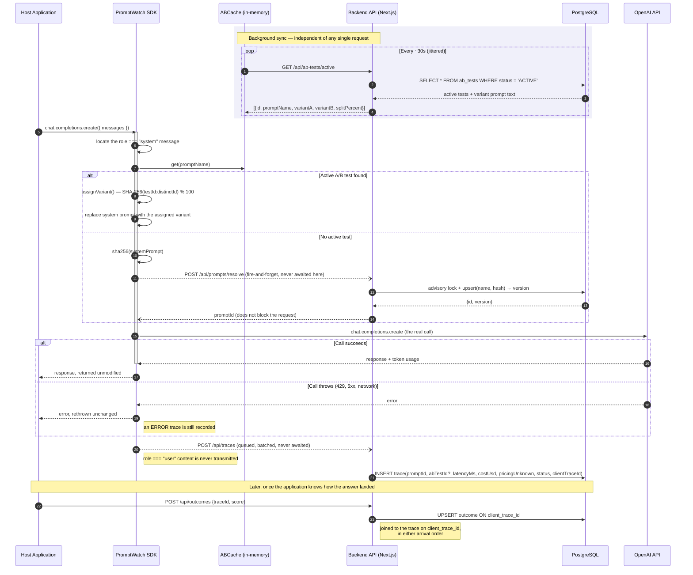
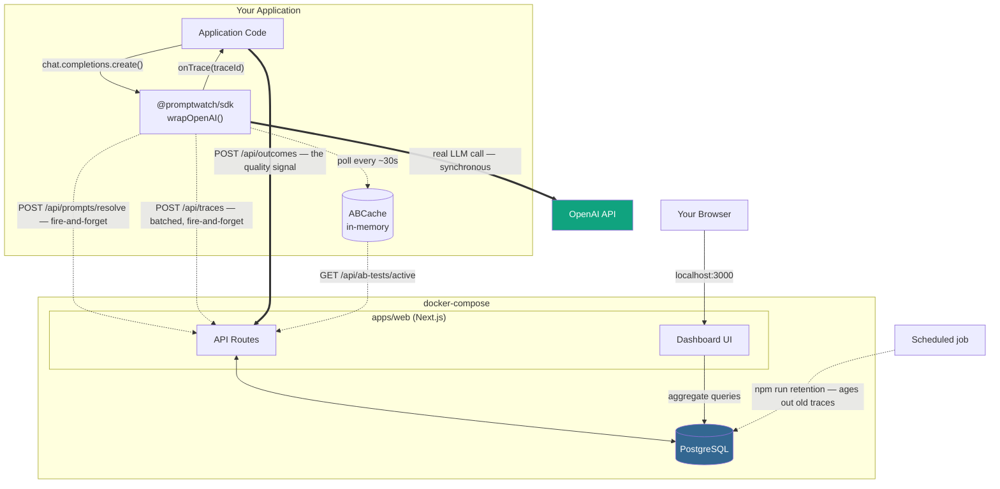

# PromptWatch

[](LICENSE)
[](https://github.com/sekerderya/prompt-watch/actions/workflows/ci.yml)
[](https://www.typescriptlang.org/)
[](https://nextjs.org/)
[](https://www.postgresql.org/)
[](https://www.docker.com/)

> Drop-in, privacy-first observability for LLM system prompts — automatic versioning, statistically-gated A/B testing, and real-time cost/latency telemetry that never blocks your model calls.

PromptWatch wraps your existing OpenAI client with a single function call. From that point on, every system prompt is automatically hashed and versioned, requests can be routed through a live A/B test with sticky per-user bucketing, and every call's cost, latency, and outcome streams to a self-hosted dashboard — without ever touching your users' data, and without PromptWatch's own backend ever sitting on the path of your model call.

Cost and latency come for free. Whether one prompt produces *better answers* is something only your application can know, so it reports a score per call and the dashboard compares variants on it — declaring a winner only when the difference is statistically significant.

`wrapOpenAI` returns a proxy; the client you pass in is left untouched, and wrapping the same client twice is a no-op rather than a source of duplicate traces.

## Quickstart

```bash
git clone https://github.com/sekerderya/prompt-watch.git
cd prompt-watch
npm install
npm run build --workspace=packages/sdk   # compile the SDK (creates packages/sdk/dist)
npx prisma generate --schema=apps/web/prisma/schema.prisma   # generate typed Prisma client for host builds
cp .env.example .env   # optional: set OPENAI_API_KEY to use real OpenAI calls
docker compose up -d   # starts PostgreSQL and the Next.js backend
npm run demo
```

Then open **http://localhost:3000**. Three pages, updating as the demo runs:

| Page | What it shows |
| --- | --- |
| **Dashboard** | Cost, request volume, error rate and reported quality across every prompt |
| **Prompts** | Every tracked prompt, its version history, a word-level diff between any two versions, per-version metrics, and a breakdown of what its failures actually were |
| **A/B Tests** | Variant comparison with a winner declared only when the difference is statistically significant |

### Step-by-step

1. **Install dependencies** — `npm install` resolves the monorepo workspaces (`apps/*`, `packages/*`, `examples/*`).
2. **Build the SDK** — `npm run build --workspace=packages/sdk` compiles `@promptwatch/sdk` and produces `packages/sdk/dist/`. Without it, `npm run demo` and `examples/basic-node-app` crash with `Cannot find module '@promptwatch/sdk'`.
3. **Generate the Prisma client** — `npx prisma generate --schema=apps/web/prisma/schema.prisma` produces the type-safe client from `apps/web/prisma/schema.prisma`. Run this before any host-side `npm run build`; without it, Prisma model types are unresolved and route callbacks can fail with "implicitly has an 'any' type" TypeScript errors.
4. **Copy the environment template** — `cp .env.example .env` creates the local env file at the repo root. Leave `OPENAI_API_KEY` empty to run the demo in mock mode, or fill it in to use real OpenAI calls.
5. **Start the stack** — `docker compose up -d` launches PostgreSQL and the backend (`apps/web`). The container automatically applies any pending prisma migrations on startup before starting the dev server, which fully handles schema setup.
6. **Run the demo** — `npm run demo` drives the full flow end-to-end: automatic prompt versioning, A/B test creation, sticky per-user bucketing, streaming, then stops the test it created so the script is safe to run repeatedly.

By default the demo runs against a deterministic mock client, so no API key is required. To see it run against real OpenAI calls, set `OPENAI_API_KEY` in `.env` before running `npm run demo`.

### Development

| Command | What it does |
| --- | --- |
| `npm test` | SDK and backend unit suites |
| `npm run test:db --workspace=apps/web` | Route handlers against a real Postgres (needs `DATABASE_URL` ending in `_test`) |
| `npm run lint` | ESLint across every workspace |
| `npm run typecheck` | `tsc --noEmit` for the SDK and the web app |
| `npm run build` | Builds the SDK, then the Next.js app |
| `npm run retention --workspace=apps/web` | Prunes telemetry past the retention window |

CI runs all of these plus a production image build against a throwaway Postgres service,
and every one of them can fail the build.

**Authentication (optional):** By default the backend runs with auth DISABLED (no `PROMPTWATCH_API_KEY` set), so the Quickstart and demo work out of the box. For any shared or internet-facing deployment, set `PROMPTWATCH_API_KEY` in `.env` — `docker-compose.yml` passes it into the backend container, which then requires `Authorization: Bearer <key>` on all API routes. The SDK attaches the key automatically when you pass `apiKey` to `wrapOpenAI()`.

## Reporting outcomes

Cost and latency are measured for you. Whether an answer was any *good* is something only
your application knows, so PromptWatch asks for it rather than guessing.

`wrapOpenAI` hands you a trace id through `onTrace`, which fires synchronously inside
`create()` — before the request reaches OpenAI, so the id is available next to the call
site even when many calls are in flight:

```ts
import { wrapOpenAI, OutcomeClient } from "@promptwatch/sdk";

const outcomes = new OutcomeClient(backendUrl, apiKey);

let pendingTraceId: string | undefined;
const client = wrapOpenAI(openai, {
  promptName: "support-agent",
  backendUrl,
  onTrace: (handle) => { pendingTraceId = handle.traceId; },
});

const answer = await client.chat.completions.create({ model, messages });
const traceId = pendingTraceId!;   // captured before the first await

// ...whenever the outcome is known: a thumbs-up, a resolved ticket, a grader's verdict.
await outcomes.record(traceId, { score: 1, label: "resolved" });
```

`score` is normalised to `0..1` so any prompt's variants stay comparable — a binary outcome
is `0` or `1`, a 1-5 star rating is `(stars - 1) / 4`. Recording is idempotent per trace id,
so a user changing their rating updates the row instead of adding a contradictory second
one, and an outcome may safely arrive before the trace it belongs to.

An application that tracks several prompts should share one poll loop and one telemetry
queue across all of them rather than wiring each separately:

```ts
import { createPromptWatch } from "@promptwatch/sdk";

const pw = createPromptWatch({ backendUrl, apiKey });
const support = pw.wrap(openai, { promptName: "support-agent" });
const summariser = pw.wrap(openai, { promptName: "summariser" });

await pw.close();   // flushes telemetry and stops polling
```

The dashboard then compares variants on quality, and only calls a winner once the gap is
statistically significant. `npm run demo` does exactly this end to end: it drives 160 calls
whose simulated satisfaction differs by variant, and the A/B page ends up reporting
something like

```
Quality Score   54.0% (n=87)      78.1% (n=73)  winner    p = 0.001
Avg. Latency    291 ms            280 ms                  no significant difference (p = 0.205)
Avg. Cost       $0.000035         $0.000034               no significant difference (p = 0.310)
```

— which is the point of the whole feature: the operational metrics say the two prompts are
indistinguishable, and only the outcome signal reveals that one is meaningfully better.

## Deploying

The Quickstart stack runs `next dev` behind a bind mount, which is right for local work and wrong for anything else. For a real deployment there is a separate multi-stage image that builds a production bundle and runs it as a non-root user:

```bash
PROMPTWATCH_API_KEY=$(openssl rand -hex 32) POSTGRES_PASSWORD=$(openssl rand -hex 16) docker compose -f docker-compose.prod.yml up -d --build
```

Both variables are required — compose refuses to start without them, so a deployment cannot inherit the demo's open-access default. Postgres publishes no host port, and the web service binds to `127.0.0.1` unless `PROMPTWATCH_BIND` says otherwise (put a TLS-terminating reverse proxy in front of it). Pending migrations are applied before the server accepts traffic.

## Operations

**Health.** `GET /api/health` performs a real database round trip and answers 503 when it
fails. It is deliberately unauthenticated — an orchestrator cannot present a bearer token,
and a health check that answers 401 always reads as unhealthy. Both the production image
and `docker-compose.prod.yml` wire it as their container healthcheck.

**Retention.** An observability tool writes a row per model call. At ten calls a second
that is ~860k rows a day, under a dashboard that scans the table for every rollup, so
telemetry ages out:

```bash
npm run retention --workspace=apps/web
```

It deletes traces older than `PROMPTWATCH_RETENTION_DAYS` (default 90; set `0` to keep
everything) in batches, and sweeps outcomes orphaned by the deletion — they have no foreign
key to traces, by design (ADR-8). Prompts and A/B tests are never deleted: they are
configuration, they are tiny, and a prompt version is the thing a future trace refers to.

Run it on a schedule. With the compose stack:

```
0 4 * * *  docker compose exec -T web npm run retention
```

## Architecture

### Request Flow (Sequence Diagram)



### System Components



## Architectural Decision Records

The reasoning behind the choices that shaped this project, including the ones it got
wrong. Each is a standalone document under [`docs/adr/`](docs/adr).

| # | Decision | Summary |
| --- | --- | --- |
| 1 | [In-Memory `ABCache` over a Centralized Redis](docs/adr/001-in-memory-abcache-over-a-centralized-redis.md) | Each SDK instance holds its own in-memory `Map` of active A/B tests, refreshed on a periodic poll (default: every 30 seconds, jittered to avoid a… |
| 2 | [Privacy-First Data Dropping](docs/adr/002-privacy-first-data-dropping.md) | The SDK inspects the outgoing message array for exactly one thing: the `role: "system"` entry. Everything else — `role: "user"` content and the… |
| 3 | [Non-Blocking, Fire-and-Forget Telemetry](docs/adr/003-non-blocking-fire-and-forget-telemetry.md) | Neither the prompt-resolve call nor the trace-logging call is ever awaited before the real OpenAI request is dispatched. PromptWatch's own backend… |
| 4 | [Opt-In Shared-Secret Auth, Not Multi-User Accounts](docs/adr/004-opt-in-shared-secret-auth-not-multi-user-accounts.md) | PromptWatch uses a single shared secret (`PROMPTWATCH_API_KEY`) that gates all backend API access. When the env var is unset or empty, auth is… |
| 5 | [Transparent Streaming Support via Stream Wrapping](docs/adr/005-transparent-streaming-support-via-stream-wrapping.md) | Wrap the OpenAI `create()` response stream with `wrapStream` so that `include_usage` can be injected silently (the synthetic usage-only chunk is… |
| 6 | [A Winner Requires Significance, Not Just a Lower Average](docs/adr/006-a-winner-requires-significance-not-just-a-lower-average.md) | The dashboard declares a winner for a metric only when both arms have at least 30 traces *and* the difference clears a two-sided test at α = 0.05… |
| 7 | [A Guessed Cost Is Labelled as a Guess](docs/adr/007-a-guessed-cost-is-labelled-as-a-guess.md) | Pricing is resolved by longest-prefix match against the request's model id. When nothing matches, the fallback rate is still applied but the trace… |
| 8 | [Outcomes Keyed on a Client-Generated Id, Not a Foreign Key](docs/adr/008-outcomes-keyed-on-a-client-generated-id-not-a-foreign-key.md) | The SDK generates a UUID per call, hands it to the host application through `onTrace`, and stamps it on the trace. Outcomes are stored in their… |
| 9 | [Corrections](docs/adr/009-corrections.md) | Every claim this project made and did not keep, what was actually true, and the test that now guards it. |
| 10 | [No Node Built-Ins in the SDK](docs/adr/010-no-node-built-ins-in-the-sdk.md) | The SDK imports nothing from `node:*`, so it runs on edge runtimes, Deno, Bun and the browser — the environments its own README recommended. |

**[ADR-9](docs/adr/009-corrections.md) is the one to read first** if you are evaluating this repo: it lists every claim the project made and did not keep, what was actually true, and the test that now guards it.
